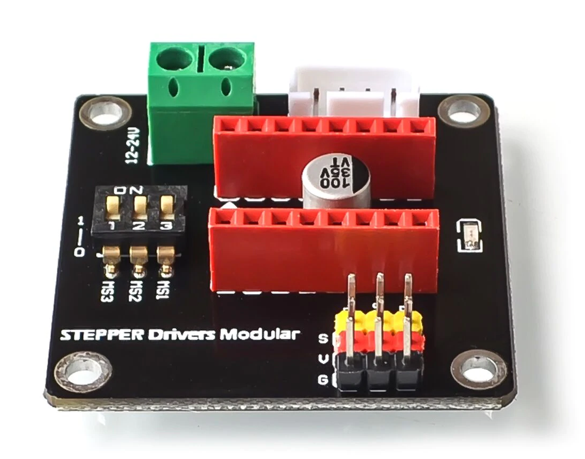
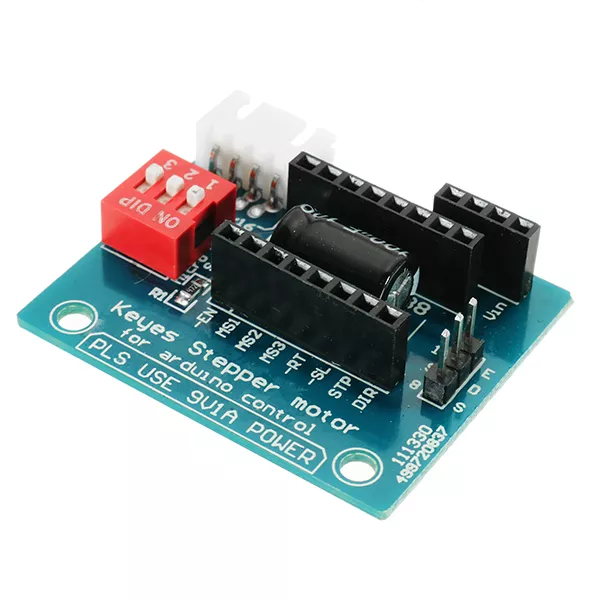

!!! failure "This feature is not included in precompiled binaries"

To use it you must [compile your build](Compile-your-build). Add the following to `user_config_override.h`:
```
#ifndef USE_A4988_STEPPER
#define USE_A4988_STEPPER    // A4988/DRV8825 stepper motor (+10k5 code)
#endif
```
----
This driver is used to control stepper-motors such as [NEMA 17](https://reprap.org/wiki/NEMA_17_Stepper_motor).   

## Configuration

### Wiring
The driverboard has several connectors: powering the controller (3.3-5.0 V), input (+/-) & output (1a/1b/2a/2b), the motor (up to 35V/2A), and to control the circuit (in order at the control side of the board):  

Connector | Description
:-:|-
DIR|Direction of rotation
STEP|Initiate stepping
MS1|Microstep increment select
MS2|Microstep increment select
MS3|Microstep increment select
EN|Enable the power supply for the motor
SLP|Sleep (bridge to RST)
RST|Reset (bridge to SLP)

### Tasmota Settings
There are six GPIO [components](Components) that should be configured to free GPIOs:  
```
A4988 DIR (170)  
A4988 STP (171)  
A4988 ENA (172)  
A4988 MS1 (173)  
A4988 MS2 (174)  
A4988 MS3 (175)
```
The minimal configuration are the `DIR` and `STEP` signals. In such a configuration the motor will be permanently powered and microstepping will be set to 1/1 (full steps).

### A4988 Controller
Detailed information about the A4988 controller can be found in the [datasheet](https://www.pololu.com/file/0J450/A4988.pdf).  

#### Microstepping Configuration  


### DRV8825 Controller
The DRV8825 is directly pin compatible with the A4988. The microstepping increment settings are different. Also, there is one additional option on the DRV8825.

#### Microstepping Configuration  


## Operation
Refer to the [Stepper Motor Commands](Commands.md#Stepper-Motors)  

`MotorRPM` is an imprecise setting due to the implementation method. Also, if the value is too high for the combination of chosen micro stepping increment (`MotorMIS`) and the number of steps the given motor needs for one revolution (`MotorSPR`), the motor will not turn but make a whining noise. You will have to experiment some to find the optimal combination for your use case.

## Example Project
The cheap auto-feeder for my cats broke. It was a fancy plastic-thingy with voice-recording-function & programmable to feed several times a day after playing back your voice (cats don't give a sh$7 about your voice - they come when they hear the food falling into the bowl). It was never precise - a concern for the amount of nutrition it gave the cats. And it was not reliable, as the torque of the internal moving mechanism was insufficient to spin the separator/proportioning wheel through the food reliably. In addition, the batteries were always drained in a day meaning very grumpy cats when we returned!  

Thus the wish to install a high-torque stepper-motor (with shifting gear) was born. I could power it with mains instead of relying on a battery, control it over WiFi from my home automation hub. Tasmota now offers a way to do this!  

The **"TasmotaSmartCatFeeder"** circuit consists of a WeMos D1 mini, a A4988 controller, and two power supplies (5V&12V). This all fits into the housing of the feeder and costs less than 50€!  

Virtually everything which has to be moved or rotated can be done now using these cheap components. It can be a window, door, shutter, cat or dog flap, a solar panel which follows the sun, a moving spotlight, PTZ-camera, or whatever.  

### Wiring Diagrams

  

[Convert 28BYJ-48 to bipolar so that it works with this driver](https://coeleveld.com/wp-content/uploads/2016/10/Modifying-a-28BYJ-48-step-motor-from-unipolar-to-bipolar.pdf)
## Breakout Boards
 
 
 

#### Buy Links
[Banggood](https://www.banggood.com/A4988DRV8825-Stepper-Motor-Control-Board-Expansion-Board-For-3D-Printer-p-1238774.html)  
[AliExpress #1](https://www.aliexpress.com/item/32908836265.html)  
[AliExpress #1](https://www.aliexpress.com/item/32870732179.html)  
