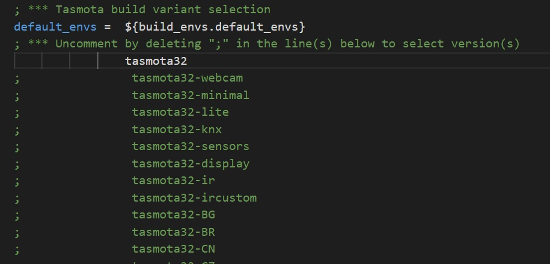

# ESP32 Support (Beta development)

!!! warning "ESP32 support is in beta and not all functions will work"

You can download precompiled development binaries from [http://ota.tasmota.com/tasmota32/release/](http://ota.tasmota.com/tasmota32/release/) or [https://github.com/arendst/Tasmota/tree/firmware/firmware/tasmota32](https://github.com/arendst/Tasmota/tree/firmware/firmware/tasmota32) and the needed ESP32 flash files [https://github.com/arendst/Tasmota/tree/firmware/firmware/tasmota32/ESP32_needed_files](https://github.com/arendst/Tasmota/tree/firmware/firmware/tasmota32/ESP32_needed_files).

Command syntax for flashing Tasmota32 firmware on ESP32 via Esptool (**replace COM port number!**):
```
esptool.py --chip esp32 --port COM5 --baud 921600 --before default_reset --after hard_reset write_flash -z --flash_mode dout --flash_freq 40m --flash_size detect 0x1000 bootloader_dout_40m.bin 0x8000 partitions.bin 0xe000 boot_app0.bin 0x10000 tasmota32.bin
```

## Compiling for ESP32

Uncomment in `platformio_tasmota32.ini` tasmota32 in line #9. Next build will create a `tasmota32.bin`. 



All binaries use `user_config_override.h` if it exists.

## Templates and Known Devices

Some known device templates and configurations

### LilyGO TTGO T-Camera OV2640_V05

In `platformio_override.ini` uncomment the line with `tasmota32` and set the correct COM port. 

In `user_config_override.h` add:

```c
#define USE_BMP
#define USE_I2C
#define USE_SPI
#define USE_DISPLAY
#define USE_DISPLAY_SSD1306
#define SHOW_SPLASH
#define USE_WEBCAM
```

Upload via USB, then apply the following Template:

```json
{"NAME":"TTGO_V05","GPIO":[1,1,1,1,5090,5088,1,1,5056,5024,5089,5091,1,1,5092,5184,0,640,608,5093,0,5152,4928,5120,0,0,0,0,4992,160,32,1,5094,0,0,5095],"FLAG":0,"BASE":2}
```

The PIR will turn ON/OFF the display and send over MQTT the POWER status. The display shows the sensor data.
To make the device work nicely, change the following settings in the Console:

Camera settings to correct orientation (USB on the bottom):
```
WCFlip ON
WCMirror ON
WCResolution 6
WCSaturation 0
WCBrightness -1
WCContrast 1
```

Display Settings (USB on the bottom):
```
DisplayRotate 2
DisplayCols 21
DisplayRows 7
DisplayMode 2
```

BME280 Settings (it is not very trustable):
```
HumOffset 10
TempOffset -15
```

PIR/Button Settings:
```
SwitchMode1 1
SetOption73 1
```

### ODROID-GO

is supported via module. Upload firmware via USB and select module `Odroid Go`


To make the device work nicely, change the following settings in the Console:
```
adcparam3 6,0,4095,0,6160
```

Display Settings:
```
DisplayRotate 3
DisplayCols 53
DisplayRows 30
DisplayMode 5
```


Rule for Joystick to dim the display:
```
on analog#joy2=1 do dimmer - endon on analog#joy2=2 do dimmer + endon
```

### AITHINKER CAM

```json
{"NAME":"AITHINKER CAM","GPIO":[4992,1,1,1,1,5088,1,1,1,1,1,1,1,1,5089,5090,0,5091,5184,5152,0,5120,5024,5056,0,0,0,0,4928,1,5094,5095,5092,0,0,5093],"FLAG":0,"BASE":1}
```

### wESP32

```json
{"NAME":"wESP32","GPIO":[0,0,1,0,1,1,0,0,1,1,1,1,5568,5600,1,0,0,0,0,1,0,0,0,0,0,0,0,0,1,1,1,1,1,0,0,1],"FLAG":0,"BASE":1}

```

### WT32-ETH01

```json
{"NAME":"WT32-ETH01","GPIO":[1,1,1,1,1,1,0,0,1,0,1,1,3840,576,5600,0,0,0,0,5568,0,0,0,0,0,0,0,0,1,1,0,1,1,0,0,1],"FLAG":0,"BASE":1}
```

### Denky (Teleinfo)

```json
{"NAME":"Denky (Teleinfo)","GPIO":[1,1,1,1,5664,1,1,1,1,1,1,1,1,1,1,1,0,1,1,1,0,1376,1,1,0,0,0,0,1,5632,1,1,1,0,0,1],"FLAG":0,"BASE":1}
```

### Olimex ESP32-PoE

```json
{"NAME":"Olimex ESP32-PoE","GPIO":[1,1,1,1,1,1,0,0,5536,1,1,1,1,0,5600,0,0,0,0,5568,0,0,0,0,0,0,0,0,1,1,1,1,1,0,0,1],"FLAG":0,"BASE":1}
```

### LilyGO ttgo-t-eth-poe

```json
{"NAME":"LilyGO ttgo-t-eth-poe","GPIO":[0,1,1,1,1,1,1,1,1,1,1,1,1,1,5600,1,0,1,1,5568,0,1,1,1,0,0,0,0,1,1,1,1,1,0,0,1],"FLAG":0,"BASE":1}
```

For working Ethernet, change the following setting in the Console:
```
EthClockMode 1
```

these 3 devices are also fully supported, more detailed info will be added later  

### TTGO ESP32 watch  
fully supported with all sensors  

### TTGO T4 
fully supported

### m5stack CORE2
```c  
#define USE_M5STACK_CORE2  
#define USE_SCRIPT_FATFS 4  
#define FAT_SCRIPT_SIZE 8192  
#define USE_SCRIPT  
#define USE_I2C  
#define USE_BMA423  
#define SAY_TIME  
#define USE_WEBRADIO  
#define USE_DISPLAY  
#define USE_SPI  

#define USE_DISPLAY_ILI9342  
#define USE_TOUCH_BUTTONS  
#define JPEG_PICTS  
#define USE_FT5206  
#define USE_MPU6886  
```

add this define to `build_flags`

```c  
-DBOARD_HAS_PSRAM  
```

fully supported with all sensors and SD card  
all pin definitions hardcoded except GPIO 33,34 for extern SCL,SDA on grove bus  
console cmd:  

`core2shutdown seconds` - shut down hardware and wake up after N seconds (>=30)  
`core2shutdown HH:MM` - shut down hardware and wake up on HH:MM time  


### Heltec WiFi Kit 32
OLED display needs the following template

```json
{"NAME":"WiFi Kit 32","GPIO":[1,1,1,1,640,1,1,1,1,1,1,608,3840,1,1,1,0,1,1,1,0,224,1,1,0,0,0,0,1,1,1,1,1,0,0,1],"FLAG":0,"BASE":1}
```


### Displays, sensors and other options 

displays: (most probably all I2C displays will work)    

```c
USE_DISPLAY_SH1106  
USE_DISPLAY_EPAPER_29  
USE_DISPLAY_EPAPER_42  
USE_DISPLAY_ILI9341  
USE_DISPLAY_ILI9488  
USE_DISPLAY_SSD1351  
USE_DISPLAY_RA8876  
USE_DISPLAY_ST7789  
USE_DISPLAY_ILI9341_2  
USE_DISPLAY_ILI9342  
```

sensors:  (most probably all I2C sensors will work)    

```c
USE_SHT3X  
USE_BMP  
USE_VL53L0X  
USE_MLX90614  
USE_IBEACON  
USE_SML_M  
```

misc:  
```c
USE_MP3_PLAYER  
USE_SCRIPT (scripting and all its options)  
USE_24C256  
USE_SENDMAIL  
```
