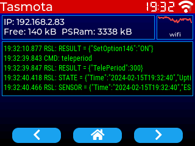
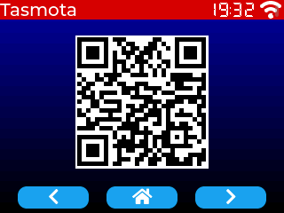
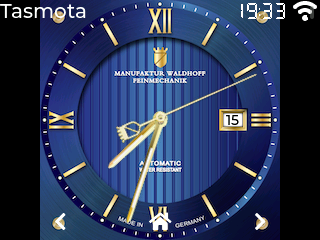
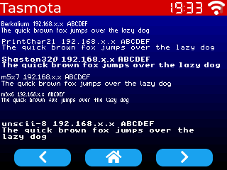

# HASPmota :material-cpu-32-bit:

!!! tip "This feature is included in tasmota32-lvgl.bin"

Tasmota is happy to support openHASP compatible format (named HASPmota), which allows to describe rich graphics interfaces using simple JSON templates. HASPmota support leverages the power of [LVGL](https://tasmota.github.io/docs/LVGL/) and the [Berry language](https://tasmota.github.io/docs/Berry/), but doesn't need to code nor learn the LVGL API.

This feature is heavily inspired from @fvanroie's [openHASP project](https://github.com/HASwitchPlate/openHASP).
 
## Minimal requirements

**Hardware**: HASPmota is supported on all ESP32 variants, and requires a display configured with universal display (using `display.ini` or `autoconf`). When they are correctly configured, you should see a splash screen at startup.

Currently **PSRAM** is strongly recommended to run HASPmota if you want to use images and external fonts. Boards without PSRAM can do basic HASPmota.

**Firmware**: HASPmota is included in `tasmota32-lvgl` firmwares, you don't need any additional `.tapp` file.

## Quick tour

You can see HASPmota in action in a couple of minutes.

Upload `tamota_demo.tapp` to your file system. The easy way is to use the following command in Tasmota console:

- `UrlFetch https://raw.githubusercontent.com/arendst/Tasmota/development/tasmota/berry/haspmota/haspmota_demo.tapp`
- `Restart 1` to restart
- Enjoy

You should see the following screen, and click on buttons to switch to the second screen:












### Understanding the template

HASPmota automatically loads the template from a file named `pages.jsonl`. This file contains JSON Lines, i.e. a single JSON document per line. Each line describes an element on the screen. Elements are grouped into pages.

Page `0` contains objects that are displayed on all screens. They are typically used for headers and menus.

The lines below define the header label (red background) and the clock and wifi widgets.

``` json
{"page":0,"comment":"---------- Upper stat line ----------"}

{"id":11,"obj":"label","x":0,"y":0,"w":320,"pad_right":90,"h":22,"bg_color":"#D00000","bg_opa":255,"radius":0,"border_side":0,"text":"Tasmota","text_font":"montserrat-20"}

{"id":15,"obj":"lv_wifi_arcs","x":291,"y":0,"w":29,"h":22,"radius":0,"border_side":0,"bg_color":"#000000","line_color":"#FFFFFF"}
{"id":16,"obj":"lv_clock","x":232,"y":3,"w":55,"h":16,"radius":0,"border_side":0}
```

The lines below describe the 3 buttons at the bottom, and their respective actions.

``` json
{"comment":"---------- Bottom buttons - prev/home/next ----------"}
{"id":101,"obj":"btn","x":20,"y":210,"w":80,"h":25,"action":"prev","bg_color":"#1fa3ec","radius":10,"border_side":1,"text":"\uF053","text_font":"montserrat-20"}
{"id":102,"obj":"btn","x":120,"y":210,"w":80,"h":25,"action":"back","bg_color":"#1fa3ec","radius":10,"border_side":1,"text":"\uF015","text_font":"montserrat-20"}
{"id":103,"obj":"btn","x":220,"y":210,"w":80,"h":25,"action":"next","bg_color":"#1fa3ec","radius":10,"border_side":1,"text":"\uF054","text_font":"montserrat-20"}
```

Page `1` is the default page, and contains different widgets types: labels and arc. The values are changed at runtime via Tasmota's rule system, see below for details.

``` json
{"page":1,"comment":"---------- Page 1 ----------"}
{"id":0,"bg_color":"#0000A0","bg_grad_color":"#000000","bg_grad_dir":1,"text_color":"#FFFFFF"}

{"id":2,"obj":"arc","x":20,"y":65,"w":80,"h":100,"border_side":0,"type":0,"rotation":0,"start_angle":180,"end_angle":0,"start_angle1":180,"value_font":12,"value_ofs_x":0,"value_ofs_y":-14,"bg_opa":0,"text":"--.-°C","min":200,"max":800,"val":0,"val_rule":"ESP32#Temperature","val_rule_formula":"val * 10","text_rule":"ESP32#Temperature","text_rule_format":"%2.1f °C"}

{"id":5,"obj":"label","x":2,"y":35,"w":120,"text":"Temperature","align":1}

{"id":10,"obj":"label","x":172,"y":35,"w":140,"text":"MPU","align":0}
{"id":11,"obj":"label","x":172,"y":55,"w":140,"text":"x=","align":0,"text_rule":"MPU9250#AX","text_rule_format":"x=%6.3f","text_rule_formula":"val / 1000"}
{"id":12,"obj":"label","x":172,"y":75,"w":140,"text":"y=","align":0,"text_rule":"MPU9250#AY","text_rule_format":"y=%6.3f","text_rule_formula":"val / 1000"}
{"id":13,"obj":"label","x":172,"y":95,"w":140,"text":"z=","align":0,"text_rule":"MPU9250#AZ","text_rule_format":"z=%6.3f","text_rule_formula":"val / 1000"}
```

Page `2` contains custom widgets as Berry code. These widgets are imported within `haspmota_widgets.tapp`

``` json
{"page":2,"comment":"---------- Page 2 ----------"}
{"id":0,"bg_color":"#0000A0","bg_grad_color":"#000000","bg_grad_dir":1,"text_color":"#FFFFFF"}

{"comment":"---------- Wifi status ----------"}
{"id":20,"obj":"lv_wifi_graph","x":257,"y":25,"w":60,"h":40,"radius":0}
{"id":21,"obj":"lv_tasmota_info","x":3,"y":25,"w":251,"h":40,"radius":0}
{"id":22,"obj":"lv_tasmota_log","x":3,"y":68,"w":314,"h":90,"radius":0,"text_font":12}
```

Finally, the following line allows to run arbitrary Berry code.

``` json
{"comment":"--- Trigger sensors every 2 seconds ---","berry_run":"tasmota.add_cron('*/2 * * * * *', def () var s = tasmota.read_sensors() if (s) tasmota.publish_rule(s) end end, 'hm_every_5_s')"}
```

The code trigger a read of sensors every 2 seconds and publish the JSON result to be parsed by the rule engine.

``` berry
tasmota.add_cron('*/2 * * * * *', def () var s = tasmota.read_sensors() if (s) tasmota.publish_rule(s) end end, 'hm_every_5_s')
```

## Running HASPmota

`HASPmota` code is included in `tasmota32-lvgl` firmwares.

Running `HASPmota` with your own template is as simple as:

- create a template in `pages.jsonl` and store it in the Tasmota file system
- create an `autoexec.be` file containing the following:

``` berry
# simple `autoexec.be` to run HASPmota using the default `pages.jsonl`
import haspmota
haspmota.start()
```


## HASPmota reference

### Integration to Berry

#### objects as `p<x>b<y>`

Each HASPmota widget is mapped to a global variable of name `p<x>b<y>`. Example:  `p1b10`. Such objects can be directly used via their attributes.

Example:

```
p1b10.x += 10
p1b10.text = "Hello"
print(p1b10.w)
```

#### pages as `p<x>`

Pages objects are mapped to a global variable of name `p<x>`.

Changing pages can be done with `p2.show()`

#### move to page programmatically

Use `haspmota.page_show(<action>)` with a parameter action taking one of the following: `next`, `prev`, `back`, `p<n>`.

```berry
haspmota.page_show('next')      # move to next page
haspmota.page_show('prev')      # move to previous page
haspmota.page_show('back')      # move to home page
haspmota.page_show('p3')        # move to page 3
```

#### additional parsing

HASPmota parses all lines from the file `pages.jsonl`. You can dynamically add new objects as JSON with `haspmota.parse(<json>)`. This functions takes a single json line. It is highly recommended to specify the page id in the json, otherwise the object is added to the current page.


### Pages

Pages object are identified by object if `0`. Example:

``` json
{"page":1,"id":0,"bg_color":"#0000A0","bg_grad_color":"#000000","bg_grad_dir":1,"text_color":"#FFFFFF"}
```

Internally HASPmota pages are implemented with LVGL screens, i.e. a parent object.

Page `0` is a special page that is displays over every screens. It is the perfect place to put navigation menus. It is implement as `lv.layer_top()`.

Page `1` is always present and the default page.

Attributes specific to page|Details
:---|:---
`prev`|(int) target page number when pressing PREV button
`next`|(int) target page number when pressing NEXT button
`home`|(int) target page number when pressing HOME button
  |And generally all object attributes

### Classes of widgets

Attribute `"obj"` can take the following values:

HASPmota Class|Embedded LVGL class
:---|:---
`obj`|`lv.obj`
`btn`|`lv.btn`
`switch`|`lv.switch`
`checkbox`|`lv.checkbox`
`label`|`lv.label`
`spinner`|`lv.spinner`
`line`|`lv.line`
`img`|`lv.img`
`dropdown`|`lv.dropdown`
`roller`|`lv.roller`
`btnmatrix`|`lv.btnmatrix`
`bar`|`lv.bar`
`slider`|`lv.slider`
`arc`|`lv.arc`
`textarea`|`lv.textarea`
`led`|`lv.led`
`chart`|`lv.chart`
`spangroup`|`lv.spangroup`
`span`|`lv.span`
`qrcode`|`lv.qrcode`

You can also import custom widget as long as they inherit from `lv.obj` and the class name matches the module name.

Example: `"obj":"lv_wifi_graph"` will trigger the following:
- `import lv_wifi_graph`
- instantiation of `lv_wifi_graph(parent)` object
- if successful, it can be used like a typical HASPmota object

### Attributes

Below are the standard attributes:

Attribute name|LVGL equivalent|Details
:---|:---|:---
`comment`||Ignored
`meta`|any|Any data, can be retrieved from Berry code with `p<x>b<y>.meta`
`page`|0 to 15<br>Parent screen object|Page id for the current object.<br>If not present, takes the value of the current page
`id`|0..255|Id number of the object. Id `0` means the entire page.<br>A global berry object is created with name `p<page>b<id>` (ex: `p1b10`)
`obj`|widget class|Class of the widget (see above).<br>If not present, the entire JSON line is ignored
`action`|`"next"`, `"prev"`, `"back"` or `"p<x>"`|Switch to page when the object is touched
`x`|`x`|X coordinate of top left corner
`y`|`y`|Y coordinate of top left corner (Y is pointing down)
`h`|`height`|Height in pixels
`w`|`width`|Width in pixels
`hidden`|flag `lv.OBJ_FLAG_HIDDEN`|Object is hidden (bool)
`enabled`|flag `lv.OBJ_FLAG_CLICKABLE`|Object is touch/clickable (bool)
`click`|flag `lv.OBJ_FLAG_CLICKABLE`|Synonym of `enabled`. Object is touch/clickable (bool)
`toggle`|flag `lv.STATE_CHECKED`|When enabled, creates a toggle-on/toggle-off button. If false, creates a normal button.<br>TODO check if bool or string
`radius`|`style_radius`|Radius of rounded corners
`bg_opa`|`style_bg_opa`|Opacity: `0` is transparent, `255` is opaque
`bg_color`|`style_bg_color`|Color of background, format is `#RRGGBB`
`bg_grad_color`|`style_bg_grad_color`|Color of background gradient
`bg_grad_dir`|`style_bg_grad_dir`|Gradient direction<br>`0`: none<br>`1`: Vertical (top to bottom) gradient<br>`2`: Horizontal (left to right) gradient
`border_side`|`style_border_side`|Borders to be displayed (add all values)<br>`0`: none<br>`1`: bottom<br>`2`: top<br>`4`: left<br>`8`: bottom<br>`15`: full (all 4)
`border_width`|`style_border_width`|Width of border in pixels
`border_color`|`style_border_color`|
`line_color`|`style_line_color`|Color of line
`line_width`|`style_line_width`|
`line_width1`|`style_arc_width`|Sets the line width of an `arc` indicator part
`pad_left`|`style_pad_left`|Left padding in pixels
`pad_right`|`style_pad_right`|Right padding in pixels
`pad_top`|`style_pad_top`|Top padding in pixels
`pad_bottom`|`style_pad_bottom`|Bottom padding in pixels
`pad_all`|`style_pad_all`|Sets all 4 padding values at once (Write-only)

### Attributes related to text content

Attribute name|LVGL equivalent|Details
:---|:---|:---
`text`|`text`|Sets the inner text of the object.<br>If the native LVGL object does not support text (like `lv.btn`), a `lv.label` sub-object is automatically created.
`value_str`|`text`|Synonym of `text`
`align`|`style_text_align`|Set alignment for text<br>`0` or `"left"`: `lv.TEXT_ALIGN_LEFT`<br>`1` or `"center"`: `lv.TEXT_ALIGN_CENTER`<br>`2` or `"right"`: `lv.TEXT_ALIGN_RIGHT`
`text_font`|`style_text_font`|Sets the font name and size for the text.<br>If `int`, the default font is `robotocondensed_latin1` and the parameter sets the size<br>If `string`, the font is in the form `<font_name>-<font_size>`, example: `montserrat-20` or in the form `A:<font_file>` to load a binary font from the file-system.
`value_font`|`style_text_font`|Synonym of `text_font`
`text_color`|`style_text_color`|Sets the color of text
`text_decor`|`style_text_decor`|Sets the text decorator, can be ORed<br>`0`: none<br>`1` underline<br>`2`: strike-through
`text_opa`|`style_text_opa`|Sets the text opacity<br>`0`: transparent<br>`255`: opaque 
`text_letter_space`|`style_text_letter_space`|Set the letter space in pixels
`text_line_space`|`style_text_line_space`|Set the line space in pixels.
`value_color`|`style_text_color`|Synonym of `text_color`
`value_ofs_x`|`x` of sub-label|Sets the X offset in pixels within the object
`value_ofs_y`|`y` of sub-label|Sets the Y offset in pixels within the object
`text_rule`||Link the text to a Tasmota rule, see below
`text_rule_formula`||Link the text to a Tasmota rule, see below
`text_rule_format`||Link the text to a Tasmota rule, see below

### Attributes related to values

Attribute name|LVGL equivalent|Details
:---|:---|:---
`min`|`range`|Set the minimum value of range (int)
`max`|`range`|Set the maximum value of range (int)
`val`|`value`|Set the value (int)
`val_rule`||Link a value to a Tasmota rule, see below
`val_rule_formula`||Link a value to a Tasmota rule, see below

### `btn`

Example:


```json
{"id":11,"obj":"btn","x":0,"y":60,"w":80,"h":30,"bg_color":"#4f4f4f","text_color":"#FFFF44","radius":10,"text":"Disabled","border_width":3,"border_side":15,"border_color":"#FFFF44","border_opa":210,"enabled":false}
{"id":12,"obj":"btn","x":100,"y":60,"w":80,"h":30,"bg_color":"#4f4f4f","text_color":"#FFFF44","radius":10,"text":"Enabled","border_width":3,"border_side":15,"border_color":"#FFFF44","border_opa":210}

{"id":13,"obj":"btn","x":0,"y":100,"w":80,"h":30,"text_color":"#FFFF44","radius":0,"text":"Disabled","border_width":3,"border_side":15,"border_opa":210,"enabled":false,"bg_color":"#884488","border_color":"#DD3300"}
{"id":14,"obj":"btn","x":100,"y":100,"w":80,"h":30,"text_color":"#FFFF44","radius":0,"text":"Enabled","border_width":3,"border_side":15,"bg_color":"#884488","border_color":"#DD3300"}
```

### `switch`

Example:


```json
{"id":11,"obj":"switch","x":0,"y":60,"w":60,"h":30,"bg_color":"#4f4f4f","bg_color20":"#FFFF88","bg_color11":"#FF4400"}
{"id":12,"obj":"switch","x":80,"y":60,"w":60,"h":30,"toggle":true,"bg_color":"#4f4f4f","bg_color20":"#FFFF88","bg_color11":"#FF4400"}
{"id":13,"obj":"switch","x":160,"y":60,"w":60,"h":30,"enabled":false,"bg_color":"#4f4f4f","bg_color20":"#FFFF88","bg_color11":"#FF4400"}
{"id":14,"obj":"switch","x":240,"y":60,"w":60,"h":30,"toggle":true,"enabled":false,"bg_color":"#4f4f4f","bg_color20":"#FFFF88","bg_color11":"#FF4400"}

{"id":21,"obj":"switch","x":0,"y":100,"w":130,"h":30,"bg_color":"#4f4f4f","bg_color20":"#FFFF88","bg_color11":"#FF4400","text":"On","text_color":"#FFFF44","text_color01":"#000000"}
{"id":22,"obj":"switch","x":140,"y":100,"w":130,"h":30,"toggle":true,"bg_color":"#4f4f4f","bg_color20":"#FFFF88","bg_color11":"#FF4400","text":"Off","text_color":"#FFFF44","text_color01":"#000000"}
```


Attribute name|LVGL equivalent|Details
:---|:---|:---
`toggle`||`true` or `false`: read or change the value of the switch
`bg_color`||Color of the indicator when the switch is Off
`bg_color11`||Color of the indicator when the switch is On
`bg_color20`||Color of the knob
`text_color`||Color of the text when the switch if Off
`text_color01`||Color of the text when the switch if On
`radius20`||Radius of the knob.

### `arc`

Attribute name|LVGL equivalent|Details
:---|:---|:---
`start_angle`|`bg_start_angle`|Start angle of the arc background.<br>Angles are in degrees in [0;360] range.<br>Zero degrees is at the middle right (3 o'clock) of the object and the degrees are increasing in clockwise direction.
`end_angle`|`bg_end_angle`|End angle of the arc background.
`start_angle1`|`start_angle`|Start angle of the arc indicator.
`end_angle1`|`end_angle`|End angle of the arc indicator.
`rotation`|`rotation`|Offset to the 0 degree position
`type`|`mode`|Sets the arc mode<br>`0`: `lv.ARC_MODE_NORMAL`<br>`1`: `lv.ARC_MODE_REVERSE`<br>`2`: `lv.ARC_MODE_SYMMETRICAL`
`pad_top2`|`style_pad_top`|Top padding for `lv.PART_KNOB` part
`pad_bottom2`|`style_pad_bottom`|Bottom padding for `lv.PART_KNOB` part
`pad_left2`|`style_pad_left`|Left padding for `lv.PART_KNOB` part
`pad_right2`|`style_pad_right`|Right padding for `lv.PART_KNOB` part
`pad_all2`|`style_pad_all`|Set all 4 padding for `lv.PART_KNOB` part (write-only)
`radius2`|`style_radius`|Radius for `lv.PART_KNOB` part

### `img`

Example:


```json
{"id":11,"obj":"img","x":10,"y":60,"src":"A:colors-icon.png"}
{"id":12,"obj":"img","x":120,"y":60,"src":"A:colors-icon.png","scale":350,"angle":150,"image_recolor":"#FFFF88","image_recolor_opa":200}
{"id":13,"obj":"img","x":230,"y":60,"src":"tasmota_logo","image_recolor":"#FFFFFF","image_recolor_opa":255}
```

Attribute name|LVGL equivalent|Details
:---|:---|:---
`src`|`src`|Path to the image in the file-system<br>`"tasmota_logo"` to use the embedded logo in Flash. Note that this logo is black, so it needs to be recolored to white on dark background
`image_recolor`|`style_image_recolor`|Color used to recolor the image
`image_recolor_opa`|`style_image_recolor_opa`|Opacity of image recoloring<br>`0`: no recolor<br>`255`: full recolor
`scale`<br>`scale_x`<br>`scale_y`|`scale`|Zoom value, `256` (default) is no zoom, `128` is half size, `256` is double size<br>`scale_x` and `scale_y` can be used to the scale independently horizontally and vertically (non-uniform scale)
`angle`|`angle`|Angle of the image, in 1/10th of degrees. Range `0`..`3600`
`antialias`|`antialias`|`true` (defaul) the transformations are higher quality but slower

### `roller`

Example:


```json
{"id":11,"obj":"roller","x":10,"y":55,"options":"Option 1\nOption 2\nOption 3\nOption 4","val":1,"bg_color50":"#FF4400","text_color":"#FFFF88","text_color50":"#000000","border_color":"#FFFF88"}
```

Attribute name|LVGL equivalent|Details
:---|:---|:---
`options`|`options`|(string) options separated by `\n`
`val`||The number of the selected item, `0` (default) is the first item
`bg_color50`||Background color of the selected item
`text_color`||Text color of non-selected options
`text_color50`||Text color of the selected options
`text`|`selected_text`|(read-only) Get the text of the currently selected item. The string is truncated to the first 256 bytes.

### `spinner`

Attribute name|LVGL equivalent|Details
:---|:---|:---
`angle`||The length of the spinning segment in degrees - can be changed after initial value since v12.1.1.1
`speed`||The time for 1 turn in ms - can be changed after initial value since v12.1.1.1


### `led`

Example:


Example from `pages.jsonl`:

```json
{"id":11,"obj":"led","x":10,"y":60,"w":20,"h":20,"color":"#FF0000"}
{"id":12,"obj":"led","x":60,"y":60,"w":20,"h":20,"color":"#FF0000","val":200}
{"id":13,"obj":"led","x":110,"y":60,"w":20,"h":20,"color":"#FF0000","val":0}

{"id":21,"obj":"led","x":10,"y":100,"w":20,"h":20,"color":"#00FF00"}
{"id":22,"obj":"led","x":60,"y":100,"w":20,"h":20,"color":"#00FF00","val":200}
{"id":23,"obj":"led","x":110,"y":100,"w":20,"h":20,"color":"#00FF00","val":0}
```

Attribute name|LVGL equivalent|Details
:---|:---|:---
`val`<br>`brightness`|`set_brightness`|The brightness from `0` (off) to `255` (on)
`color`|`set_color`|The overall color of the led


### `chart`

!!!note "This object is not part of OPENhasp."

The `chart` object allows to track values over time and show them in a graph.


Example of `pages.jsonl`:
```json
{"page":10,"id":10,"obj":"chart","x":10,"y":60,"w":230,"h":120,"bg_color":"#440000","border_color":"#FFFF44","bg_opa":100,"border_color":"#0099EE","border_width":1,"radius":0,"pad_all":2,"y_min":0,"y_max":50,"point_count":50,"height10":0,"width10":0,"v_div_line_count":0,"h_div_line_count":5,"line_color":"#555555","line_width30":3}

{"comment":"--- Add random values to chart every second ---","berry_run":"tasmota.add_cron('*/1 * * * * *', def () import math var val = math.rand() % 50 global.p10b10.val = val val = math.rand() % 50 global.p10b10.val2 = val end, 'hm_every_1_s_chart')"}
```

You can also add values programmatically:

```berry
global.p10b10.val = 10
global.p10b10.val = 40
global.p10b10.val = 30
global.p10b10.val = 40
global.p10b10.val = 20

global.p10b10.val2 = 45
global.p10b10.val2 = 35
global.p10b10.val2 = 55
global.p10b10.val2 = -5
global.p10b10.val2 = 25
```

Attribute name|LVGL equivalent|Details
:---|:---|:---
`x_min`<br>`x_max`<br>`y_min`<br>`y_max`|`set_range`|Set the minimum and maximum values for `x` or `y` scales. Default are 0..100 for both axis.
`point_count`|`point_count`|Set the number of points to display in the chart. Default is `10`. Changing this value clears the content of the chart.
`height10`<br>`width10`||Set the height and width for dots for each value. Set to `0` to remove dots and live only lines.
`v_div_line_count`<br>`h_div_line_count`|`div_line_count`|Set the number of division lines vertically and horizontally. Detault for `v_div_line_count` is `5`, for `h_div_line_count` is `3`.<br>Change the division line color with `line_color`.
`type`|`chart_type`|Change the chart type.<br>`0`: Don't draw the series<br>`1` (`LINE`): Connect the points with lines<br>`2` (`BAR`): Draw columns.<br>`3` (`SCATTER`): Draw points and lines in 2D (x,y coordinates).
`series1_color`<br>`series2_color`|`set_series_color`|Sets the color for each series
`val`<br>`val2`||Add a value to the fist series with `val` and to second series with `val2`.
`zoom_x`<br>`zoom_y`|`zoom`|Zoom into the chart in X or Y direction.<br>`256` for no zoom, `512` double zoom.
`update_mode`|`update_mode`|Set update mode of the chart object, default is `SHIFT`.<br>`0`: (`SHIFT`) Shift old data to the left and add the new one the right<br>`1`: (`CIRCULAR`) Add the new data in a circular way

### `spangroup` (styled text)

!!!note "Available (since v13.4). This object is not part of OPENhasp."

The `spangroup` object is equivalent to HTML `<span>` and allows to have a text area composed of multiple fragments, each fragment with its own style, size, font, color...


Example:

```json
{"id":11,"obj":"spangroup","x":0,"y":60,"w":300,"h":115,"text_font":"montserrat-20","bg_color":"#000088","bg_opa":255}
  {"id":12,"obj":"span","parentid":11,"text":"This is "}
  {"id":13,"obj":"span","parentid":11,"text":"RED","text_color":"#FF0000","text_font":"montserrat-28"}
  {"id":12,"obj":"span","parentid":11,"text":"and this is "}
  {"id":14,"obj":"span","parentid":11,"text":"GREEN","text_color":"#00FF00","text_font":"montserrat-28","text_decor":1}
  {"id":15,"obj":"span","parentid":11,"text":" underlined"}
  {"id":16,"obj":"span","parentid":11,"text":"\nAnd this is almost transparent","text_opa":100}
```

You must first define a `spangroup` object, and add as many as `span` sub-objects. You need to define the `parentid` attribute to the `spangroup`.

Note: span are parsed in the order in the jsonl file, not by id number. Text from span can be updated via rules, like normal HASPmota text.

Attribute name|LVGL equivalent|Details
:---|:---|:---
`align`|`set_align`|Similar to `label` object<br>`0`: (default) align auto<br>`1`: align left<br>`2`: align center<br>`3`: align right
`mode`|`set_mode`|Display modes:<br>`0`: fixes the object size<br>`1`: expand the object size to the text size but stay on a single line<br>`2`: (default) keep width, break the too long lines and auto expand height
`overflow`|`set_overflow`|Trucature modes:<br>`0`: (default) truncates the text at the limit of the area<br>`1`: will display an ellipsis `(...) when text overflows the area
`indent`|`set_indent`|Set the indent of the first line in pixels
`max_lines`|`set_max_lines`|Set the maximum number of lines to be displayed in `mode`=`2`, negative values indicate no limit

Each `span` sub-object must have an explicit `parentid` to the `spangroup`, and accepts only the following attributes (mostly from `lv_style`):

Attribute name|LVGL equivalent|Details
:---|:---|:---
`text`|`set_text`|Sets the text of the `span` element, use `\n` for a new line
`text_color`|`set_text_color`|Sets the color of text
`text_decor`|`set_text_decor`|Sets the text decorator, can be ORed<br>`0`: none<br>`1` underline<br>`2`: strike-through
`text_opa`|`set_text_opa`|Sets the text opacity<br>`0`: transparent<br>`255`: opaque 
`text_letter_space`|`set_text_letter_space`|Set the letter space in pixels
`text_line_space`|`set_text_line_space`|Set the line space in pixels.

### `qrcode`

Attribute name|LVGL equivalent|Details
:---|:---|:---
`qr_size`||Size in pixels of the QRCode, always square (height = width). This cannot be changed once the object is created.
`qr_dark_color`||Color used for the dark pixels. This cannot be changed once the object is created.
`qr_light_color`||Color used for the light pixels. This cannot be changed once the object is created.
`qr_text`||(mandatory) String to encode as a QRCode, can be changed at any moment.

## HASPmota styling

Since v13.2.0.1, HASPmota includes styling extensions replicating [OpenHASP Styling Properties](https://www.openhasp.com/0.6.3/design/styling/).

Styling attributes can include a 2-digit suffix to indicate which element and which state the styling attributes refers to:

The part indexes are:

- 00 = main part of the object (i.e. the background)
- 10 = the indicator or needle, highlighting the the current value
- 20 = the knob which can be used the change the value
- 30 = the background of the items/buttons
- 40 = the items/buttons (not implemented yet)
- 50 = the selected item
- 60 = major ticks of the gauge object
- 70 = the text cursor
- 80 = the scrollbar
- 90 = other special part, not listed above

The state indexes:

- 00 = default styling
- 01 = styling for toggled state
- 02 = styling for pressed, not toggled state
- 03 = styling for pressed and toggled state
- 04 = styling for disabled not toggled state
- 05 = styling for disabled and toggled state

A `toggle` `btn` can be made to show `text` `yellow` when toggled ON with `"text_color":"white","text_color01":"yellow"`

The following attributes accept styling suffix:

- `radius`
- `border_side`
- `border_width`
- `border_color`
- `line_width`
- `bg_color`
- `bg_grad_color`
- `bg_grad_dir`
- `line_color`
- `pad_left`
- `pad_right`
- `pad_top`
- `pad_bottom`
- `pad_all`
- `text_color`

## Tasmota extensions

### Update sensor value via rules

You can automatically adjust attributes `val` and `text` from sensor values via a simple rule engine.

attribute|description
:---|:---
val\_rule|Rule pattern to trigger an update of the `val` attribute.<br>Example: `"val_rule":"ESP32#Temperature"`
val\_rule\_formula|Optional expression (using Berry) to transform the value extracted from the rule to the value pushed to `val`. This typically allows to adjust ranges of values.<br>Input value is always converted to `float` not `int`. The input value is named `val`.<br>Example: `"val_rule_formula":"val / 1000"` 

Changing a `text` attribute from rules:

attribute|description
:---|:---
text\_rule|Rule pattern to trigger an update of the `text` attribute.<br>Example: `"text_rule":"ESP32#Temperature"`
text\_rule\_formula|Optional expression (using Berry) to transform the value extracted from the rule to the value pushed to `val`. This typically allows to adjust ranges of values.<br>Input value is always converted to `float` not `int`. The input value is named `val`.<br>Example: `"val_rule_formula":"val * 10"`
text\_rule\_format|String format of the result string. The format uses Berry's `string.format()`, which is a subset of `printf` format.<br>Example: `"text_rule_format":"%2.1f °C"`

### React to user actions

Every time the user touches an active element on the screen, HASPmota publishes internal events you can listen and react to. For example if you press a button `p1b10`, HASPmota publishes an event `{"hasp":{"p1b10":{"event":"up"}}` when the button is released. You can easily create a rule to react to this event.

Example:

``` berry
tasmota.add_rule("hasp#p1b10#event=up", / -> print("Button p1b10 pressed"))
```

Events with value `changed` indicate that the value of the widgets has changed. Events are only fired if the change in value comes from a screen interaction. No event is fired when the value was changed programmatically. The new value is sent as `val` attribute, and for specific widgets (roller) a `text` attribute is sent for the label of the value. `{"hasp":{"p1b1":{"val":3,"text":"A3","event":"changed"}}}`

Example:

``` berry
tasmota.add_rule("hasp#p1b1#text", / text-> print("p1b1 text value=", text))
```

### Run arbitrary Berry code

Inserting an attribute `berry_run` to any object will compile and run the embedded Berry code right after widget initialization. If you need the current widget object, it requires a special construct like: `"berry_run":"return def (x) print(x) end"`

One common use is to trigger sensors read every 2 seconds:

``` json
{"comment":"--- Trigger sensors every 2 seconds ---","berry_run":"tasmota.add_cron('*/2 * * * * *', def () tasmota.publish_rule(tasmota.read_sensors()) end, 'oh_every_5_s')"}
```

## HASPmota fonts

HASPmota can use 3 types of LVGL fonts:

- embedded fonts, i.e. fonts included in Tasmota firmware
- binary bitmat fonts (extension `.lvfont`), stored in the Tasmota file-system using `lv_font_conv` tool. Tasmota includes various fonts pre-converted
- TrueType fonts (extension `.ttf`), stored in the Tasmota file-system. TrueType vector fonts can be scaled at any size and render well at high font-sizes, but require significant PSRAM memory

### Embedded fonts

Use attribute `"text_font":"unscii-8"`. The general form is `"text_font":"<font_name>-<font_size>"`


Embedded font|Details
:---|:---
`montserrat-10`<br>`montserrat-14`<br>`montserrat-20`<br>`montserrat-28`|Default LVGL normal font, including icons
`unscii-8`<br>`unscii-16`|Default LVGL, 8 px and 16 px pixel perfect font with only ASCII characters
`seg7-8`<br>`seg7-10`<br>`seg7-12`<br>`seg7-14`<br>`seg7-16`<br>`seg7-18`<br>`seg7-20`<br>`seg7-24`<br>`seg7-28`<br>`seg7-36`<br>`seg7-48`|7 segments display, contains digits, space, ':' and '!' for a space of the size of ':'<br>Sizes 8, 10, 12, 14, 16, 18 are pixel-perfect bold<br>Sizes 20, 24, 28, 36, 48 are dithered (2 bits per pixel) bold-italic
`robotocondensed-12`<br>`robotocondensed-16`<br>`robotocondensed-24`|Default OpenHASP

### Binary bitmap fonts

Files of extension `.lvfont`, they are similar to embedded fonts but can be loaded dynamically from the file-system.

Generally speaking, binary bitmap fonts are mostly used for low resolution font, or they take too much memory. For larger font, prefer TrueType fonts (see below).

#### Pixel-perfect fonts

Pixel-perfect fonts don't use dithering and are specially designed for low resolution monochrome displays.

example:


Same image zoomed x2


`unscii-8` (bottom font) is embedded by default.

To use the other fonts, add the corresponding file to the Tasmota file system.

Fonts below are from [KreativeKorp](http://www.kreativekorp.com/software/fonts/apple2/)

- `Berkelium64.lvfont` Berkelium (BSW) GEOS System Font
- `PrintChar21.lvfont` The Ultimate Apple II Font
- `Shaston320.lvfont` Shaston GS/OS System Font

Fonts below are from Daniel Linssen 

- `m5x7.lvfont` <https://managore.itch.io/m5x7>
- `m3x6.lvfont` <https://managore.itch.io/m3x6>


Here is the HASPmota template for the screen above:

``` jsonl
{"page":0,"comment":"---------- Upper stat line ----------"}
{"id":0,"text_color":"#FFFFFF"}
{"id":11,"obj":"label","x":0,"y":0,"w":320,"pad_right":90,"h":22,"bg_color":"#D00000","bg_opa":255,"radius":0,"border_side":0,"text":"Tasmota","text_font":"montserrat-20"}

{"id":15,"obj":"lv_wifi_arcs","x":291,"y":0,"w":29,"h":22,"radius":0,"border_side":0,"bg_color":"#000000","line_color":"#FFFFFF"}
{"id":16,"obj":"lv_clock","x":232,"y":3,"w":55,"h":16,"radius":0,"border_side":0}

{"page":1,"comment":"---------- Page 1 ----------"}
{"id":5,"obj":"label","x":2,"y":30,"w":316,"text":"Berkelium 74192.168.x.x ABCDEF\nThe quick brown fox jumps over the lazy dog","text_font":"A:Berkelium64.lvfont"}
{"id":6,"obj":"label","x":2,"y":55,"w":316,"text":"PrintChar21 192.168.x.x ABCDEF\nThe quick brown fox jumps over the lazy dog","text_font":"A:PrintChar21.lvfont"}
{"id":7,"obj":"label","x":2,"y":80,"w":316,"text":"Shaston320 192.168.x.x ABCDEF\nThe quick brown fox jumps over the lazy dog","text_font":"A:Shaston320.lvfont"}
{"id":8,"obj":"label","x":2,"y":105,"w":316,"text":"m5x7 192.168.x.x ABCDEF\nThe quick brown fox jumps over the lazy dog","text_font":"A:m5x7.lvfont"}
{"id":9,"obj":"label","x":2,"y":130,"w":316,"text":"m3x6 192.168.x.x ABCDEF\nThe quick brown fox jumps over the lazy dog","text_font":"A:m3x6.lvfont"}

{"id":99,"obj":"label","x":2,"y":170,"w":316,"text":"unscii-8 192.168.x.x ABCDEF\nThe quick brown fox jumps over the lazy dog","text_font":"unscii-8"}
```

### TrueType fonts


Add support for TTF fonts in HASPmota. The attributes needs to specify the font name and the size `"text_font":"sketchbook.ttf-32"`

Example:


Related `pages.jsonl` file:

``` jsonl
{"page":0,"comment":"---------- Upper stat line ----------"}
{"id":0,"text_color":"#FFFFFF"}
{"id":11,"obj":"label","x":0,"y":0,"w":320,"pad_right":90,"h":22,"bg_color":"#D00000","bg_opa":255,"radius":0,"border_side":0,"text":"Tasmota","text_font":"montserrat-20"}

{"id":15,"obj":"lv_wifi_arcs","x":291,"y":0,"w":29,"h":22,"radius":0,"border_side":0,"bg_color":"#000000","line_color":"#FFFFFF"}
{"id":16,"obj":"lv_clock","x":232,"y":3,"w":55,"h":16,"radius":0,"border_side":0}

{"page":1,"comment":"---------- Page 1 ----------"}
{"id":1,"obj":"label","x":2,"y":40,"w":316,"text":"sketchbook-32\n192.168.x.x ABCDEF\nThe quick brown fox jumps over the lazy dog","text_font":"sketchbook.ttf-32"}
```
