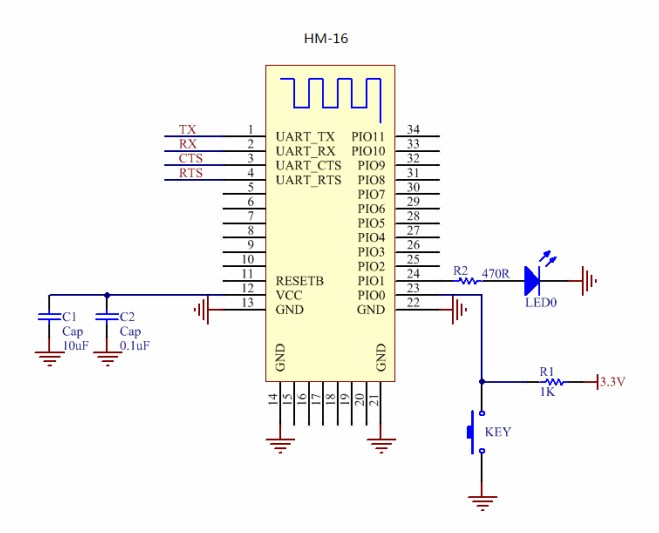
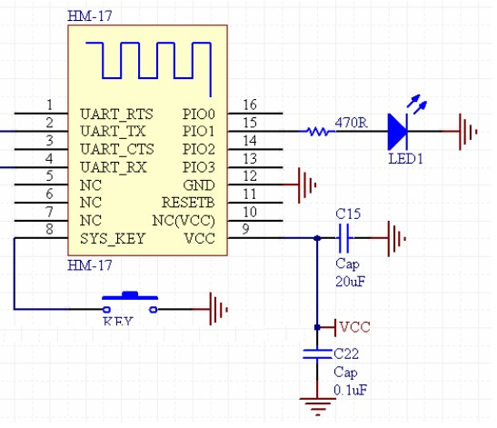
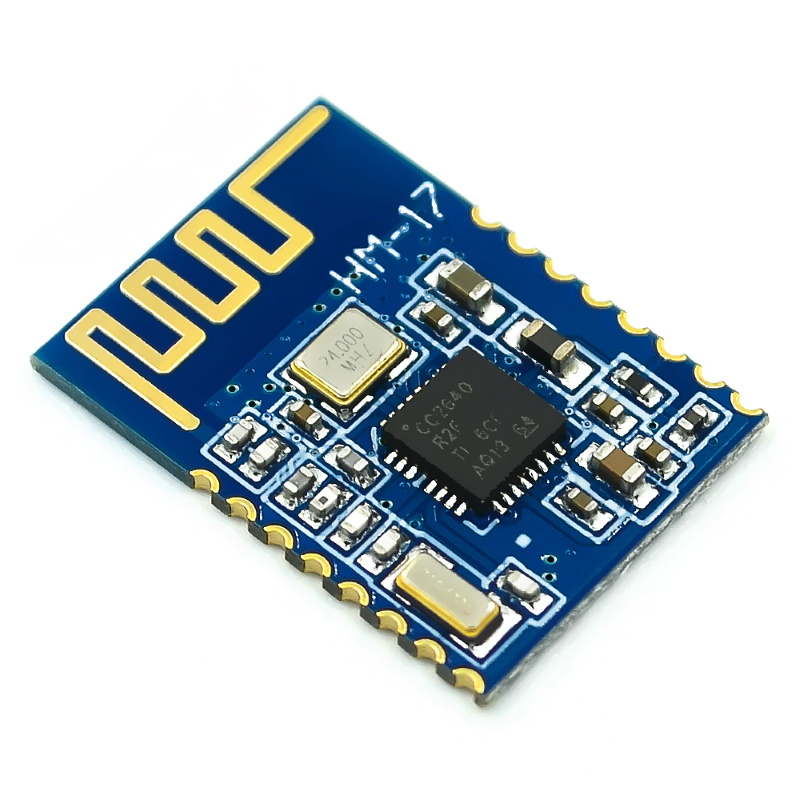

# HM-17 Bluetooth module

??? tip "This feature is included only in `tasmota-sensors`" 

    When [compiling your build](Compile-your-build) add the following to `user_config_override.h`:
    ```c++
    #ifndef USE_HM10
    #define USE_HM10          // Add support BLE sensor bridge (+5k1 code)
    #endif
    #ifndef USE_IBEACON
    #define USE_IBEACON          // Add support for bluetooth LE passive scan of ibeacon devices 
    #endif
    ```

HM-17 and HM-16 are a Bluetooth BLE V4.1 module based on TI CC2640R2f chip. Manufactured by [Jinan Huamao](http://www.jnhuamao.cn/bluetooth.asp) 


## Configuration
Check whether your module is communicating properly over its TX/RX pins and that it has the required firmware (firmware V120 or V110). Only when you're sure everything is ok proceed with the configuration.

### Wiring
| HM-16/17   | ESP |
|---|---|
|GND   |GND   
|VCC   |3.3V
|TX   | GPIOx
|RX   | GPIOy



### Tasmota Settings for iBeacon

In the **_Configuration -> Configure Module_** page assign:

1. GPIOx to `iBeacon TX (168)`
2. GPIOy to `iBeacon RX (169)`

When first connected HM-16/17 is in peripheral mode. You have to change it to central mode using commands `Sensor52 1` and `Sensor52 2`.

If you have supported iBeacon Bluetooth devices in range, they will be discovered and will start to populate the webUI with data:


For a complete overview of supported devices, commands and features read the [Bluetooth article](/Bluetooth#ibeacon)

## Breakout Boards


