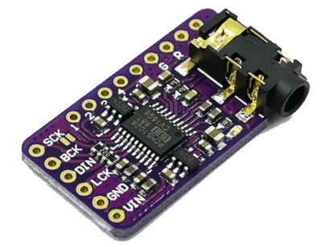
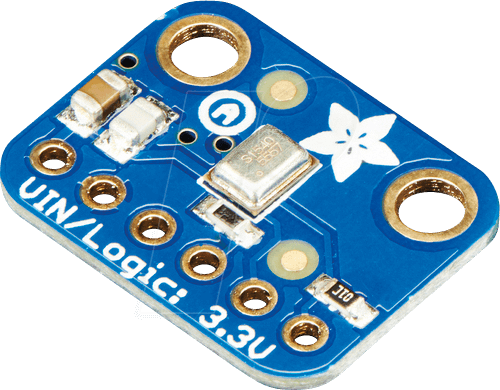

# I2S Audio

??? failure "This feature is not included in precompiled binaries"  

    When [compiling your build](Compile-your-build) add the following to `user_config_override.h`:
    To use it you must [compile your build](Compile-your-build). Add the following to `user_config_override.h`:

    ```arduino
    #ifndef USE_I2S_AUDIO
    #define USE_I2S_AUDIO                             // Add support for I2S audio output
    // #define USE_I2S_NO_DAC                         // Add support for transistor-based output without DAC
    // #define USE_I2S_LSB                            // Add support for LSBJ chips, e.g. TM8211/PT8211
    // #define USE_I2S_WEBRADIO                       // Add support for MP3 web radio streaming (only on ESP32 with PSRAM)
    // #define USE_I2S_SAY_TIME                       // Add support for english speaking clock
    // #define USE_I2S_RTTTL                          // Add support for Rtttl playback
    #endif

    // USE_M5STACK_CORE2, USE_TTGO_WATCH and ESP32S3_BOX already include I2S_AUDIO
    ```
    Also requires `lib_extra_dirs = lib/lib_audio, lib/libesp32_audio` added to the build environment


I2S (Inter-IC Sound) is a serial, synchronous communication protocol that is usually used for transmitting audio data between two digital audio devices.

## Audio Output

{ align=right width="200" }

For audio output an I2S digital audio decoder (DAC) board is required. It is recommended to use an external DAC

|I2S DAC | ESP32 | ESP8266 (fixed pins) |
| --- | --- | --- |
|BCLK|I2S_BCLK| GPIO15
|LRCK/WS|I2S_WS| GPIO02
|DIN|I2S_DOUT| GPIO03
| SD | NC | 
| GAIN | NC |
| VIN | 3V3 or 5V | 3V3 or 5V |
| GND | GND | GND |

### Internal DAC

ESP32 has two 8-bit DAC (digital to analog converter) channels, connected to GPIO25 (Channel 1) and GPIO26 (Channel 2).

Those channels can be driven via the I2S driver when using the “built-in DAC mode” enabled with `USE_I2S_NO_DAC`

### Commands

|CMD DAC|action|
|---|---|
|I2SGain | `0..100` = sets the volume of the audio signal |
|I2SPlay | `/file.mp3` = plays a .mp3 audio file from the file system, the systems blocks until sound is played<BR>`+/file.mp3` = plays a .mp3 audio file from the file system, sound is played in a separate task not blocking the system|
|I2SRtttl| `string` = play [Ring Tones Text Transfer Language (RTTTL)](https://www.mobilefish.com/tutorials/rtttl/rtttl_quickguide_specification.html) ringtones (requires defined `USE_I2S_RTTTL`) |
|I2SSay  | `text` = speaks the text you typed (only English language supported)|
|I2STime | tells current Tasmota time in English (requires defined `USE_I2S_SAY_TIME`)|
|I2SWr   | `url` = starts playing an [mp3 radio](http://fmstream.org/) stream, no blocking (requires defined `USE_I2S_WEBRADIO`)<BR>no parameter = stops playing the stream|

## Audio Input

??? failure "This feature is not included in precompiled binaries"  

    When [compiling your build](Compile-your-build) add the following to `user_config_override.h`:
    To use it you must [compile your build](Compile-your-build). Add the following to `user_config_override.h`:

    ```arduino
    #ifndef USE_I2S_AUDIO
    #define USE_I2S_AUDIO                    // Add support for I2S audio output (needed even if using only microphone)
    #define USE_I2S_MIC                      // Add support for I2S microphone
    //#define MIC_PDM                        // Set microphone as PDM (only on ESP32)
    //#define MIC_CHANNELS 1                 // 2 = stereo (I2S_CHANNEL_FMT_RIGHT_LEFT), 1 = mono (I2S_CHANNEL_FMT_ONLY_RIGHT)
    //#define MICSRATE 32000                 // Set sample rate
    #define USE_SHINE                        // Use MP3 encoding (only on ESP32 with PSRAM)
    //#define MP3_MIC_STREAM                 // Add support for streaming microphone via http (only on ESP32 with PSRAM)
      //#define MP3_STREAM_PORT 81           // Choose MP3 stream port (default = 81)
    #endif

    // USE_M5STACK_CORE2, USE_TTGO_WATCH and ESP32S3_BOX already include I2S_AUDIO
    ```

### I2S Microphone

{ align=right width="200" }

For microphone input an I2S microphone must be connected.

| I2S Microphone | ESP32 | ESP8266 (fixed pins) |
| --- | --- | --- |
| SCK | I2S_BCLK | GPIO13 |
| WS | I2S_WS | GPIO14 |
| SD | I2S_DIN | GPIO12 |
| L/R | GND | GND |
| VDD | 3.3V | 3.3V |
| GND | GND | GND |

If you're using only the microphone without a DAC you still need to set pin `I2S_DOUT` to an unused GPIO.

### PDM Microphone

[Pulse density modulation](https://en.wikipedia.org/wiki/Pulse-density_modulation) (PDM) microphones are not an I2S or PWM microphone but still have a digital signal. They're used in [ESP32-S3-BOX](https://templates.blakadder.com/espressif_ESP32-S3-BOX.html), [Seeed Xiao Sense](https://templates.blakadder.com/seeedstudio_XIAO_ESP32S3_SENSE.html) and others.

Compile Tasmota with `MIC_PDM` defined.

| Microphone | ESP32 |
| --- | --- | 
| CLK | I2S_WS | 
| DATA | I2S_DIN | 
| L/R | GND | 
| VDD | 3.3V |
| GND | GND | 
| NC | I2S_DOUT |
| NC | I2S_BCLK | 

When using PDM microphones the microphone CLK pin is configured as `I2S_WS` in Tasmota.

### Commands

!!! warning "ESP32 with PSRAM required!"

| CMD | Action |
| --- | --- |
| I2SMGain | `1..50` = sets the gain factor of the microphone |
| I2SRec | (requires defined `USE_SHINE`)`/file.mp3` = starts recording a .mp3 audio file to the file system, no blocking<BR> no parameter = stops recording<BR>`-?` = shows how many seconds already recorded |
| I2SStream |(requires defined `MP3_MIC_STREAM`)<BR>`1` = starts streaming .mp3 server at `http://<device_ip>:81/stream.mp3`<BR> `1` = stop the stream |

## I2S Audio Bridge

Starts an UDP audio service to connect 2 ESP32 devices as an audio intercom ([an example](https://github.com/arendst/Tasmota/discussions/16226)). 

Needs audio output and microphone on 2 devices (no PSRAM needed)  

```arduino
#ifndef I2S_BRIDGE
#define USE_I2S_AUDIO                       // Add support for I2S audio output
#define USE_I2S_MIC                         // Add support for I2S microphone
#define I2S_BRIDGE                          // Add support for UDP PCM audio bridge
  //#define I2S_BRIDGE_PORT    6970         // Set bridge port (default = 6970)
#endif
```

|CMD bridge|action|
|---|---|
| I2SBridge | `ip` = sets the IP of the slave device<BR>`0` = stop bridge<BR>`1` = start bridge in read mode<BR>`2` = start bridge in write mode<BR>`3` = start bridge in loopback mode<BR>`4` = set bridge to master<br>`5` = set bridge to slave<br>`6` = set microphone to swapped<BR>`7` = set microphone to not swapped<BR>`p<x>` = sets the push to talk button where `x` is the button's GPIO pin number|

If a push to talk button is defined the bridge goes to write mode if the button is pushed and to read mode if the button is released  
