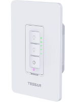
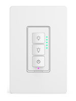

# PWM Dimmer

!!! info "PWM dimmer is supported in standard tasmota.bin"
      To enable PWM dimmer operation, select the PWM Dimmer module.

PWM Dimmer module adds support PWM dimmer switches. The brightness of the load for these dimmers is controlled by a PWM GPIO pin. They typically have power, up and down buttons, a powered-on LED, five brightness LEDs and another status LED. Some of supported devices are switches model SD0x from Martin Jerry, Acenx, Tessan, NTONPOWER.  

## PWM Dimmer Operation

Pressing and releasing the power button toggles the power on/off. If the toggle turns the power on, the load is returned to the last brightness it was adjusted to. If Fade is enabled, the load is faded on/off at the rate defined by the Speed setting.

When the power is on, holding the down or up button decreases/increases the brightness. The brightness can also be changed using just the power button. When the power is on, holding the power button alternately increases or decreases the brightness. Initially, holding the power button increases the brightness. Releasing and then holding the power button again decreases the brightness.

When the power is off, pressing and releasing the down or up button turns the power on at a temporary brightness of the low/high levels set by the BriPreset command. Turning the power on at the low preset can also be accomplished by holding the power button while the power is off. The brightness presets are intended to enable quickly turning on a light to a dim or bright level without changing the normal desired brightness. Turning the power on to a preset does not change the brightness the load will be set to when the switch is turned on the next time. For example, if the light is on and you adjust the brightness to 80 and then turn the light off, when you turn it back on, the brightness will return to 80. If you turn the power off again and then press the down button, the light will be turned on with a brightness of the low preset. If you then turn the light off and on again, the brightness will return to 80.

When the power is off, holding the down or up button publishes an MQTT EVENT command. The topic follows the format of the Full Topic with a prefix of Event (ex. `cmnd/LightSwitch1/EVENT`). The MQTT payload is Trigger#, where # is 1 if the down button is held or 2 if the up button is held. These triggers can be used in rules on remote devices  (ON `Event#Trigger1`) or by automation software to trigger automations such as scene changes. For example, the Event topic Trigger1 payload could trigger the automation software to turn on the previous scene in a list and the Trigger2 payload could trigger the automation software to turn on the next scene in a list.

If there are LED’s defined in the template, they are turned on to indicate the current brightness. More LEDs are turned on at higher brightnesses. Option 86 enables/disables an LED timeout. If SetOption86 is enabled, the LED’s turn off five seconds after the last change in brightness. Note that the lowest LED and the blue power LED are always on when the power is on. The LED timeout can also be enabled/disabled by holding the power button while tapping (pressing and releasing quickly) the down button.

The LEDLink LED can be used as a nightlight/powered-off indicator. `SetOption 87` enables/disables turning the LEDLink LED on when the power is off. The powered-off indicator can also be enabled/disabled by holding the power button and tapping the up button.

Holding the power button, tapping the down button and then tapping or holding the down or up button sends a device group message to set RGB lights in the device group to the previous/next fixed color. The command is sent/value is adjusted once every .5 seconds for as long as the button is held. The color sequence as defined by the Light module is red, green, blue, orange, light green, light blue, amber, cyan, purple, yellow, pink, white using RGB channels, white using CT channels.

Holding the power button, tapping the up button and then tapping or holding the down or up button publishes an MQTT Event command. The command is sent/value is adjusted once every .5 seconds for as long as the button is held. The MQTT topic is as described above. The MQTT payload is Trigger#, where # is 3 if the down button is held or 4 if the up button is held.

Holding any button alone for over 10 seconds executes the WiFiConfig 2 command.

SetOption32 defines the button hold time. When the PWM Dimmer module is initially selected, SetOption32 is set to 5 (1/2 second). Button presses and holds execute the normal ButtonTopic and Rule processing. If ButtonTopic is set and SetOption61 is 0 or a the button press/hold matches a rule, the button press/hold is ignored by PWM Dimmer.

PWM Dimmer uses the Light module to control PWM. Brightness levels are rescaled to PWM values between the <dimmer_min> and <dimmer_max) values specified with `DimmerRange`. Most LED bulbs do not show a significant difference between PWM value of 1 and PWM value of 100. This results in the lower 10% of the dimmer range having no effect. For best results, `DimmerRange <dimmerMin>` value should be set to the higest value that results in the lowest bulb brightness (Typically in the range of 90 - 120).

When Device Groups are enabled, the PWM Dimmer brightness presets are kept in sync across all switches in the group. The powered-off LED and LED timeout settings are specific to each switch. Changing them does not replicate the change to the other switches in the group.

## Commands

| Command     | Parameters                                                                                                                                   |   |   |
|-------------|----------------------------------------------------------------------------------------------------------------------------------------------|---|---|
| BriPreset   | `<low>,<high>` = set brightness low and high presets `1..255` = set brightness preset `+` = increase brightness preset `-` = decrease brightness preset |   |   |
| SetOption86 | Set brightness LED timeout `0` = disable timeout (default) `1` = enable timeout                                                        |   |   |
| SetOption87 | Set powered-off LED (nightlight) `0` = disable powered-off LED (default) `1` = enable powered-off LED                                  |   |   |
| SetOption88 | Set remote device mode `0` = disable remote device mode(default) `1` = enable remote device mode                                                   |   |   |

## Remote Device Mode

Remote device mode allows PWM Dimmer switches to control remote devices. With remote device mode enabled, each button controls a different device. Note that dimmer switches with toggle-style down/up buttons have limited functionality as remote device mode switches because you can not push the down and up buttons simultaneously.

Remote device mode is included in the default tasmota binary. To include remote device mode support in other builds, define `USE_PWM_DIMMER_REMOTE` and `USE_DEVICE_GROUPS` in your user_config_override. Remote device mode support requires [device group](Device-Groups.md) support. Remote device mode support adds 1K to the code size in addition to the code size required for device groups support.

To enable remote device mode, execute `SetOption88 1` (the device will restart). Each remote device must be running firmware with device group support and have remote device support enabled. Remote devices do not need to be built with PWM dimmer support nor do they need to be switches.

If a remote device also uses the PWM Dimmer module, the device acts like a 3-way dimmer switch and may or may not have a load connected to it. It’s also possible to use a PWM dimmer switch without a load to act as a wall switch to control the power, brightness and color of one or more smart lights with Tasmota with device group support loaded on them.

With remote device mode is enabled, button 1 is the power button for the local device while buttons 2 and 3 are the power buttons for remote devices. Group names for buttons 2 and 3 are set by the `GroupTopic2` and `GroupTopic3` commands respectively. Note that the button numbers are defined by the module template and can be in any physical order on the switch (button 1 can be defined as the top button, the middle button or the bottom button). Button combinations that publish MQTT Event commands use a topic in the format `cmnd/%group-topic%/EVENT`.

Pressing and releasing a power button toggles the power on all devices in the group assigned to the button. When the power is on, holding the button alternately increases or decreases the brightness. When the power is off, holding the button turns the power on at a temporary brightness of the low level set by the [`BriPreset`](Commands#bripreset) command.

While holding a power button, the other two buttons act like the down and up buttons for the remote device. All the functions performed by the down and up buttons in non-remote device mode are available in remote device mode. While holding button 1, button 2 performs the functions of the down button and button 3 performs the functions of the up button. While holding button 2, button 1 performs the functions of the down button and button 3 performs the functions of the up button. While holding button 3, button 1 performs the functions of the down button and button 2 performs the functions of the up button.
