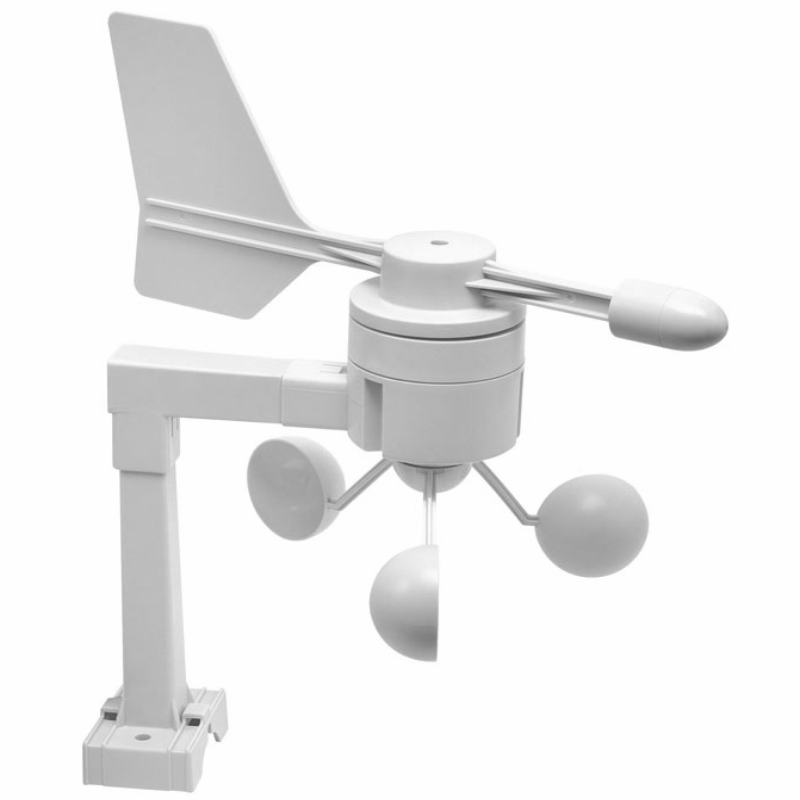

# TX20/TX23 anemometer

!!! failure "This feature is not included in precompiled binaries"     

To use it you must [compile your build](Compile-your-build). Add the following to `user_config_override.h`:

For TX20 sensor

```C
#ifndef USE_TX20_WIND_SENSOR
#define USE_TX20_WIND_SENSOR  // Add support for La Crosse TX20 anemometer (+2k6/0k8 code)
#endif
```

For TX23 sensor

```C
#ifndef USE_TX23_WIND_SENSOR
#define USE_TX23_WIND_SENSOR  // Add support for La Crosse TX20 anemometer (+2k6/0k8 code)
#endif
```

This setting  compiles Tasmota with sensor statistical values (needs the higher value size of code), which are useful for the wind sensor, since the measured values naturally change very quickly. The values generated in addition to the wind speed and wind direction are:

- Wind speed min/max
- Wind speed average (&empty;)
- Wind direction average (&empty;)
- Wind direction range (&ang;) and min/max

The average (&empty;) values are continuously calculated values.  
The range (&ang;) and min/max values are held for the time [TelePeriod](Commands.md#teleperiod) and reset after MQTT SENSOR message has been output.

If you do not want the statistical calculation having speed and direction value only, use

```C
#ifndef USE_TX2X_WIND_SENSOR_NOSTATISTICS
#define USE_TX2X_WIND_SENSOR_NOSTATISTICS
#endif
```

in your `user_config_override.h`. This will save approx. 1k8 bytes of code.

----



The TX20 (retired) and TX23 sensor supplies the two measured values wind speed and wind direction.

The TX23 sensor is still available under various brand names such as "La Crosse", "Technoline". Unfortunately, the TX20 (at least in Europe) is almost impossible to get. However, the two sensors differ only in the protocol used, but deliver the same measured values.

## Configuration

### Wiring

##### TX20

| Pin | Color       | Description | ESP8266 |
|-----|-------------|-------------|---------|
|  1  | Brown/Black | TxD         | GPIOx   |
|  2  | Red         | 3.3V        | 3.3V    |
|  3  | Green       | DTR         | GND     |
|  4  | Yellow      | GND         | GND     |

##### TX23

| Pin | Color       | Description | ESP8266 |
|-----|-------------|-------------|---------|
|  1  | Brown/Black | TxD         | GPIOx   |
|  2  | Red         | 3.3V        | 3.3V    |
|  3  | Green       | -           | -       |
|  4  | Yellow      | GND         | GND     |

### Tasmota Settings

In the **_Configuration -> Configure Module_** page assign:
GPIOx to `TX2x (104)`

The TX2 pin needs a pull-up resistor. The internal pull-up is activated for this so you can use any useful GPIO except GPIO15 and GPIO16 (GPIO15 is always pulled low, GPIO16 has a built-in pull-down resistor).  

To be on the save side you can add an additonal external 10k pull-up to TX2x GPIOx.

After a reboot the driver will detect TX20/TX23 automatically and display the wind data:


Sensor sends a  `tele/%topic%/SENSOR` JSON reponse:

```json
{
  "Time": "2020-03-03T00:00:00+00:00",
  "TX23": {
    "Speed": {
      "Act": 14.8,
      "Avg": 8.5,
      "Min": 12.2,
      "Max": 14.8
    },
    "Dir": {
      "Card": "WSW",
      "Deg": 247.5,
      "Avg": 266.1,
      "AvgCard": "W",
      "Min": 247.5,
      "Max": 247.5,
      "Range": 0
    }
  },
  "SpeedUnit": "km/h"
}
```

### Commands

The wind speed unit is set to km/h as default. You can change the unit using the command  
`SpeedUnit <x>` where \<x> = `1…6`:
- 1 = m/s (meter per second)
- 2 = km/h (kilometer per hour)
- 3 = kn (knots)
- 4 = mph (miles per hour)
- 5 = ft/s (foot per second)
- 6 = yd/s (yard per second)

The changed unit will appear in the webUI and via MQTT SENSOR messages.