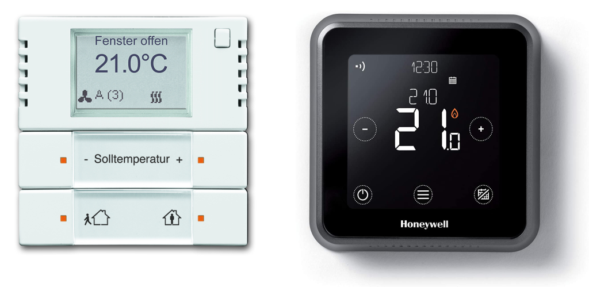
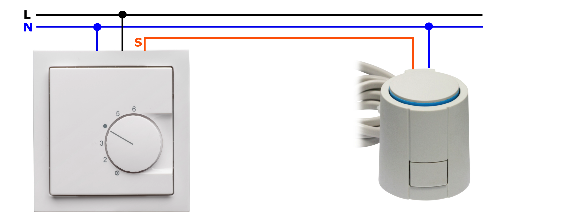
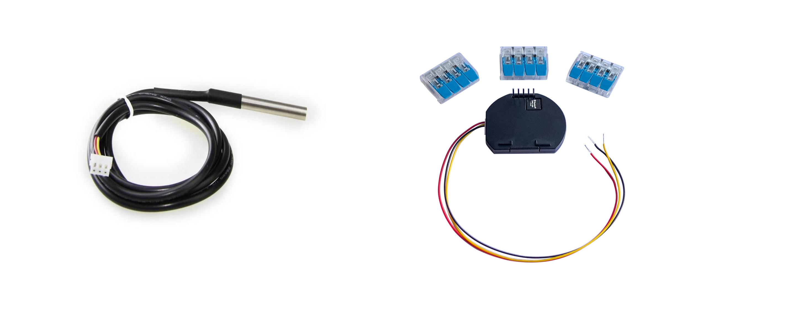
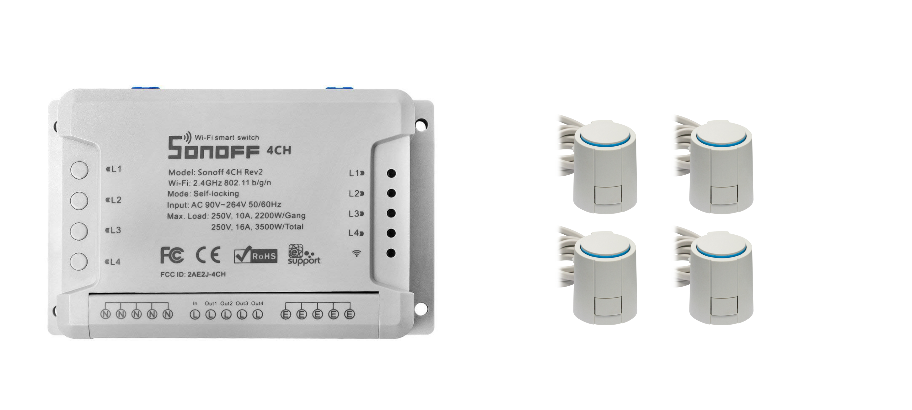

# Thermostat

The Thermostat driver allows the tasmota device, provided it receives the temperature input via MQTT or a locally connected sensor, to follow control heating/cooling strategies to reach the desired setpoint. The thermostat offers similar functions as feature reach commercial ones, similar to the ones found below:



## Typical setup: Heating floor system

A typical setup for heating room systems can be found in the picture below. A conventional room thermostat is connected to a heating floor valve actuator, both running at AC voltage (f.i. 220V). The thermostat is connected to neutral as well as to the phase, the actuator to the same neutral connection of the thermostat and to its actuation signal. The actuation signal will switch between the neutral voltage (actuation Off) and the phase voltage (actuation On).

The conventional room thermostats offer nowadays either 2 point control with hysteresis or a more advanced PI (Proportional-Integral) control. The result of the PI control is typically transformed into a PWM signal with a pre-defined period and a variable duty cycle.



### Use of tasmota switch to bypass an existing wall thermostat

A tasmota switch can be installed in a way that it bypasses the existing wall thermostat. The advantage of this setup is that the thermostat driver offers the possibility to follow the output of the existing wall thermostat or acting autonomously. This setup allows a seamless integration with existing wall thermostats and gives the user the freedom to still use them.

Below you can find an example of a Shelly switch bypassing a wall thermostat:


## Temperature input / setpoint

### Local temperature sensor

The tasmota driver can receive the temperature either via the related MQTT command or via a local temperature sensor (see example of a DS18B20 temperature sensor and a shelly temperature sensor addon below).



The default temperature input is MQTT. The following command can be used to select the local sensor as default input:

```
cmnd/Tasmota_Name/SENSORINPUTSET 1
```

### MQTT temperature value and setpoint

The following commands can be used to provide the driver with the temperature value of the room and the desired setpoint:

```
cmnd/Tasmota_Name/TEMPMEASUREDSET 22.5
```

```
cmnd/Tasmota_Name/TEMPTARGETSET 21.8
```

Note: Examples for room temperature of 21.8°C and temperature setpoint of 22.5°C.

There are several ways to send the MQTT room temperature. For the development and testing of this driver, a Raspberry Pi with Domoticz and a Z-Wave stick has been used to gather all room temperatures from Z-Wave sensors and send them to the respective Tasmota room thermostats.

## Customize your controller for the best results

The thermostat controller includes a default parameter set that targets a typical floor heating application for mid-sized rooms (< 20m2) with one heating circuit. The controller is however highly configurable via MQTT. The following sections will guide the user to adapt the main parameters to improve the performance of the thermostat controller via customization.

### 

## Advanced features

### Multi-controller

The tasmota driver can be compiled to be used in devices with more than one output, allowing independant controllers for each one of the outputs. This feature has been successfully tested with an Sonoff 4CH PRO R2.



To increase the number of controller outputs, modify the value of the thermostat controller outputs in my_user_config.h or redefine it in user_config_override.h and compile a customized tasmota software.

```
#define THERMOSTAT_CONTROLLER_OUTPUTS         1         // Number of outputs to be controlled independently
```

### Future improvements

#### Cooling

The controller offers the possibility to switch from heating to cooling. Due to lack of cooling setup at the time of the development of the driver, this feature has however not been propertly tested. Testers for cooling are therefore welcomed.

The following MQTT command can be used to switch from heating (default) to cooling:

```
cmnd/Tasmota_Name/CLIMATEMODESET 1
```

#### "Ramp-Up" controller

The "Ramp-Up" controller evaluates the time constant of the system and predicts when to switch off the actuator to reach the desired temperature as fast as possible. This controller offers the best speed to reach the Setpoint. This controller will be improved by a learning process to evaluate how accurate the target value has been reached without overshoot. This feature will improve the behavior of the current controller which depending on the application and thermal capacity of the system might produce some overshoot. By default the controller set is the Hybrid one, enabling "Ramp-Up" for big temperature deltas between Setpoint and measured temperature and PI for smaller ones. If you are not satisfied with the performance of this controller in your system, you can disable it by MQTT and force the use of the PI controller exclusively. For that purpose the following command can be used:

```
cmnd/Tasmota_Name/CONTROLLERMODESET 1
```

#### PI Autotune

A PI autotune feature following the Zigler-Nichols closed loop algorithm has been implemented. This feature is untested and will be further developed soon. To enable it for testing purposes add the following define in user_config_override.h and compile a customized tasmota software.

```
#define USE_PI_AUTOTUNING // (Ziegler-Nichols closed loop method)
```
