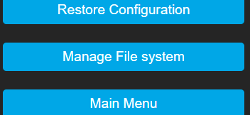
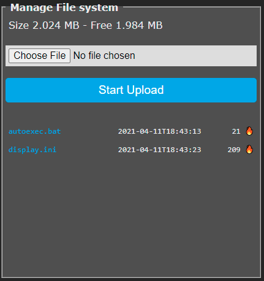

!!! failure "This feature is not included in precompiled binaries."
To use it, you must [compile your build](Compile-your-build).

For modules that have more than 1MB of flash memory (NodeMCU, Wemos-D1, ESP32) you can build a variant 
with a _universal file system or UFS_ and store your files there (data, images, commands, etc).
There are some special files that you can upload and use to execute actions.

!!! warning
    The file partition **DOES NOT** get erased by reset commands. Only a complete flash erase will remove it

## Compiling UFS enabled firmware

Copy `platformio_override_sample.ini` as `platformio_override.ini`

For ESP8266 boards, activate by removing the `;` in front of one of the below lines:

* `board_build.ldscript = eagle.flash.4m2m.ld` for 2Mb universal file system    
* `board_build.ldscript = eagle.flash.4m1m.ld` for 1Mb universal file system

Adding the following `#define` in your `user_config_override.h` will enable those features:

* `#define USE_UFILESYS`   Enable the Universal File System including Flash File System
* `#define GUI_TRASH_FILE` Allows to delete files from the GUI File Manager
* `#define GUI_EDIT_FILE` Allows to edit text files in the Web GUI

!!! warning "About ESP32"
    **ESP32** boards with default 4MB flash only support a file system **limited to 64KB**. You need a board with more 
    than 4MB to enable a larger file system.

Extending file system size on ESP32 is performed through the `board_build.partitions` setting. 
This is currently provided only on ODroid-Go and M5Stack Core2 boards with a 12MB file system. No changes
of any build files are needed for those boards as the proper partition file will be used automatically.

If you have another ESP32 board with more than 4MB and want to enable a larger file system, it is recommended 
to create your own [custom variant](Compile-your-build#defining-multiple-custom-firmwares)
by getting inspiration from ODroid-Go and Core variants.

## UFS in the Web GUI

After compiling and flashing you will find a new entry in Tasmota webUI: ***Configuration - Manage File system***



The "Manage File System" page provides:

* On top, the total size of the file system and the free size
* A button to upload a file from the host (1st select the file with the `Choose File` button, then `Start Upload`)
* A list of available files with timestamp of upload and size in bytes
* If GUI_TRASH_FILE is enabled, the 'fire' icon allows to delete the file **without any confirmation**
* If GUI_EDIT_FILE is enabled, the 'memo' icon allows to edit the file and the "Create and edit new file"
button launches the editor with a new file.



The file editor allows to edit the content of a text file online, save it back to the UFS. 
By changing the name at the top, it will be saved-as the new name (original file remains unchanged).
Changes can be discarded by clicking on the button "Manage File System" to returns to the manager.


## Commands
Complete list of [UFS commands](Commands#ufs)

Also look into [Berry scripting language](Berry.md#loading-code-from-filesystem) for ESP32 which works with UFS.

## Special files

### autoexec.bat

Stores commands that will be executed at every boot, similar to the backlog commands in rules trigger at `System#Boot`. 

Almost any command can be used in the file. However, avoid commands that will make the device reboot, 
such as: changing Wifi setting, MQTT settings, Templates & GPIO, etc. Commands that triggers reboot
will create a boot loop which will force Tasmota to automatically disable `autoexec.bat` and other settings.
See [SetOption36](Commands#setoption36) for more details.

Commands must be kept one command per line and they will be executed sequentially.

### display.ini

Stores data that will be displayed at every boot, similar to the DisplayText commands in rules trigger at `System#Init` (as long as you have a display driver initializated).

!!! example
    ```
    ; clr screen
    [z]
    ; draw full screen picture - corona.rgb file must exist in UFS storage
    [x0y0P/corona.rgb]
    ; define index color
    [dc19:31000]
    ; draw transparent text with new index color
    [x60y30f2Ci19D2]Tasmota
    ```

### autoexec.be

For ESP32 with [Berry scripting language](Berry.md), `autoexec.be` file will be automatically
loaded and executed at the start of the VM.
