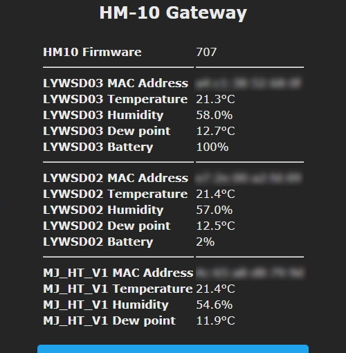

!>**This feature is included only in tasmota-sensors.bin**

Otherwise you must [compile your build](compile-your-build). Add the following to `user_config_override.h`:
```
#ifndef USE_HM10
#define USE_HM10          // Add support for HM-10 as a BLE-bridge (+5k1 code)
#endif
```

The HM-10 is a Bluetooth Low Energy module manufactured by [Jinan Huamao](http://www.jnhuamao.cn/bluetooth.asp). The communication with the ESP8266 works over serial connection using AT-commands.

## Not every HM-10 is the same

The chance to buy a clone on the market is very high. While they look similar and utilize the same Bluetooth chip, the firmware on them is different. In order to get them to work in Tasmota it is mandatory to [flash the original firmware on it](https://github.com/Jason2866/CCLoader). The HM-10 needs at least firmware V609 or the newest V707 to work with the Tasmota driver.

> [!TIP] It is possible to do this without soldering by directly sticking male jumper wire connectors through the plastic foil on some boards or using some removable adhesives (bluetack).  

## Configuration
Check whether your module is communicating properly over its TX/RX pins and that it has the required firmware. Only when you're sure everything is ok proceed with the configuration.

#### Wiring
| HM-10   | ESP8266 |
|---|---|
|GND   |GND   
|VCC   |3.3V
|TX   | GPIOx
|RX   | GPIOy

#### Tasmota Settings 
In the _Configuration -> Configure Module_ page assign:
1. GPIOx to `HM10 TX (195)`
2. GPIOy to `HM10 RX (194)`

If you have the proper firmware and everything is properly connected, webUI should show (707 is firmware version number):


If you have supported Bluetooth devices in range, they will be discovered and will start to populate the webUI with data:



### Features
Supported sensors (except the MJ_HT_V1) will be connected to at a set interval (default interval equals TelePeriod). A subscription is established for 5 seconds and data (e.g. temperature, humidity and battery) is read and reported to an mqtt topic (Dew point is calculated):

```json
tele/%topic%/SENSOR = {"Time":"2020-03-24T12:47:51","LYWSD03-52680f":{"Temperature":21.1,"Humidity":58.0,"DewPoint":12.5,"Battery":100},"LYWSD02-a2fd09":{"Temperature":21.4,"Humidity":57.0,"DewPoint":12.5,"Battery":2},"MJ_HT_V1-d8799d":{"Temperature":21.4,"Humidity":54.6,"DewPoint":11.9},"TempUnit":"C"}
```

After a completed discovery scan, the driver will report the number of found sensors. As Tasmota can not know how many sensors are meant to be discovered you have to force a re-scan until the desired number of devices is found.
```console
Rule1 ON HM10#Found<6 DO Add1 1 ENDON ON Var1#State<=3 DO HM10Scan ENDON 
```
This will re-scan up to 3 times if less than 6 sensors are found.

Complete overview of supported Bluetooth devices can be found in the [Bluetooth article](/Bluetooth)

#### Commands

Command|Parameters
:---|:---
HM10Scan<a id="hm10scan"></a>|Start a new device discovery scan
HM10Period<a id="hm10period"></a>|Show interval in seconds between sensor read cycles. Set to TelePeriod value at boot.<BR>|`<value>` = set interval in seconds
HM10Baud<a id="hm10baud"></a>|Show ESP8266 serial interface baudrate (***Not HM-10 baudrate***)<BR>`<value>` = set baudrate
HM10AT<a id="hm10at"></a>|`<command>` = send AT commands to HM-10. See [list](http://www.martyncurrey.com/hm-10-bluetooth-4ble-modules/#HM-10%20-%20AT%20commands)
HM10Time <a id="hm10time"></a>|`<n>` = set time time of a **LYWSD02 only** sensor to Tasmota UTC time and timezone. `<n>` is the sensor number in order of discovery starting with 0 (topmost sensor in the webUI list).
HM10Auto <a id="hm10auto"></a>|`<value>` = start an automatic discovery scan with an interval of  `<value>` seconds to receive data in BLE advertisements periodically.<BR>This is an active scan and it should be used **only if necessary**. At the moment that is the case just with MJ_HT_V1. This can change if a future HM-10 firmware starts supporting passive scan.

## Breakout Boards

